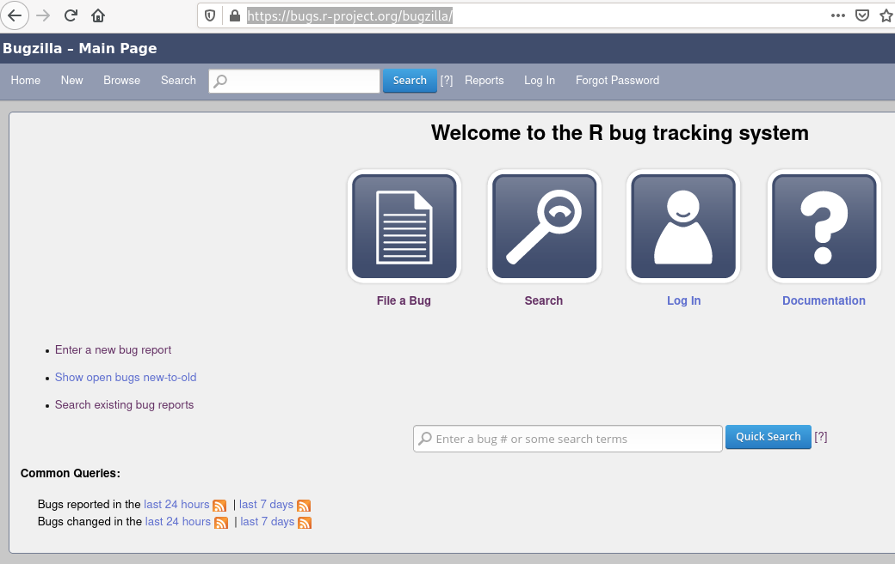
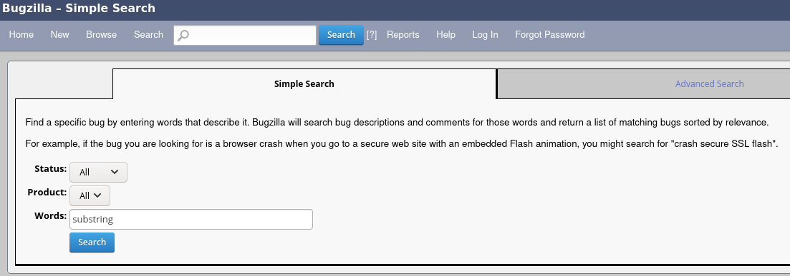
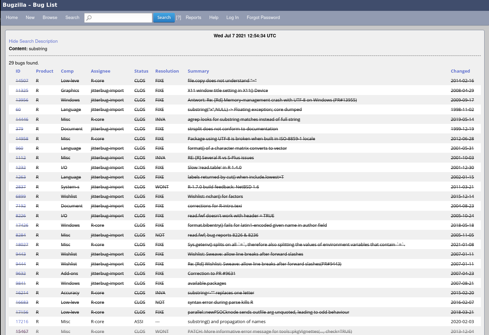

# Who We Are

## Martin Maechler - R-core (and R-Foundation)
- R-core from the start (1997) and R-Foundation Board.
  - Co-Creator (with Doug Bates) and maintainer of Matrix, cluster, robustbase, Rmpfr, ..
- ETH Zurich, adjoint Prof in Math Stats
- [ESS (Emacs Speaks Statistics)](https://ess.r-project.org/) Project Lead


## Gabriel Becker - Frequent Collaborator with R-core
- Arguably most feature additions to R from external collaborator "in recent times"
  - Proposed ALTREP, collaborated with Luke Tierney on design and implementation
  - `debug(., signature = )` and `debugcall(print(.))` with Michael Lawrence
  - `head(mymatrix, c(5, 5))` with Martin Maechler
  - `update_PACKAGES()` with Michael Lawrence
  - `sessionInfo()` returns RNG information when not the default, with Martin Maechler
  - `which()`  long vector and ALTREP support, with Martin Maechler
  - `ifelse()` refactor for significant speedup with Kurt Hornik
  - `duplicated()`/`unique()`/`anyDuplicated()` sortedness-aware ALTREP
    fastpass (for now in R-devel, only) with Michael Lawrence

# Learning How to Contribute to R
## The Goal
- **Is**
  - Helping R
  - By helping R-core maintain it
  - Thus benefiting ourselves and the larger R community
- **Is Not**
  - Professional advancement
  - Personal recognition/fame (though acknowledgment will occur)

## We will focus on
- What kinds of efforts help
  - and how to perform them
- What kinds of well-meaning efforts do not help
  - And how to avoid or improve them

# The Shoulders of Giants - Previous/Ongoing Outreach and Engagement

## The R Blog (R-core \& R Foundation)
#### https://developer.r-project.org/Blog/public/

[2019-10:](https://developer.r-project.org/Blog/public/2019/10/09/r-can-use-your-help-reviewing-bug-reports/)


[2019-12:](https://developer.r-project.org/Blog/public/2019/12/16/thanks-for-reviewing-bug-reports/)


[2021-04:](https://developer.r-project.org/Blog/public/2021/04/28/r-can-use-your-help-testing-r-before-release/)


## R-Foundation FORWARDS - R Contribution Working Group

- Organized by Heather Turner
- R Core Members
  - Luke Tierney, Michael Lawrence, Martyn Plummer
- R Foundation members
  - Jenny Bryan, Di Cook
- R community  members you may have heard of
  - Kara Woo, Amelia McNamara, Toby Hocking, Michael Chirico, Brodie Gaslam, Sebastian Meyer
  - And many you likely will soon hear of


## R Contribution Working Group

- R-devel Slack
  - ~110 members
  - not super active - **yet***
- (early ongoing development) R Developer's Guide
  - Saranjeet Kaur working with Heather Turner and Michael Lawrence
  - https://github.com/forwards/rdevguide


# Gabe As A Case Study - Illustrative Examples From a Patchy Past
# Circa 2013 - The CV Padder (AKA Graduate Student)
## PR#15253 - `identify()` Hanging
- Simon Anders posted a reproducible example
- I diagnosed the problem:
  - Hang was in `locator` C function not identify logic per se.
- I wrote and submitted a proposed patch
  - No response on bugzilla other than bug status changed to closed-fixed
  - Could see changes in trunk; patch accepted

## Bitwise Operations For Raw Vectors
- Reported by Mark Bravington
- I proposed a patch modifying the C code underlying `bitw*()` R functions
- Bitwise logical operators implemented in raw methods to standard logical operators
- Patch not accepted
- Bug closed as fixed after documentation change by R-core member

## Take Away Points
- Working patches will not always be accepted, even if nothing is wrong
  - These take the same amount of work from the submitter
- Sometimes a patch changing behavior is not the correct fix
  - Even to problems that are real

# Circa 2015 - Icarus Flies With Such Very Sturdy Wings
## PR#16385 - All logical operators (silently) behave as `!` when called with 1 argument
- Reported By Barry Rowlingson
-
```
`&`(TRUE)
FALSE
```
- Huh, that's weird...

## A Patch - My Benevolent Gift to R-core and R
...

## And Then
**Gabe**

Created attachment 1828 [details]
Fix patch

I called checkArity with the signature of Rf_checkArity (including the call) in the previous patch, which was incorrect. This patch is tested and works.

Arity check needs to happen before the special casing for unary ops (assumed to be `!` ) on simple logical scalars.

## :-|
**Martin**

<snip>
There's more:  Gabriel said "tested"... well, not really: You did not run R's own tests successfully:  These are listed as S3 generic primitives and so
 &.foo <- function(x, ...) { ........ }
has worked and this is detected by our checks.

Consequently, the checkArity() test should *not* happen before dispatch...

I'm currently testing things

## So ... Yeah. Not Great.
Take away points:

- Test your patches
- Test your patches
- Test your patches

# Circa 2017 - Feature Engineering Over and Over

## My First Added Feature (That ~0 People Know About Or Use)
- `debug(., signature = )` and `eval(debugcall(print(myclassedobj)))`
- S3 and S4 dispatch aware debugging.
  - Masks the weird .local thing function shenanigans you got in S4 method debugging at the time.

## Some things to keep in mind about this success story
- I worked (as my job) with Michael Lawrence at Genentech during this time
  - He had just been elected to R-core
- 20+ comment conversation on bugzilla about it
  - 4 distinct versions of the patch

## More context
- I disagreed with Michael and Martin about design/API for `debugcall`
  - My patches after the first iteration implemented their preferred API
- Accepted, but not until after feature freeze
  - Remained in R-devel only for nearly a year
- Patch was still further refactored by Michael in the process

# Circa 2016 - 2019  - The ALTREP Years
## The Proposal
- Proposed ALTREP at DSC 2016 (research conference/R-core meeting)
  - Was in contact with Luke before meeting, had informal interest
  - Accepted as a way forward following meeting
  - Was proposing enormous internal change - "Backwards Compatible" were first two words in talk title.

## Implementation 2017-2018

- My proof of concept was a type of vector that was a "window" to another vector's data
  - "Worked" but didn't respect R's copy on write semantics
- Luke implemented the ALTREP framework
  - I contributed code, some is still in, some was buggy so not accepted/taken back out.
- Luke asked that Michael review my code internally (we were still both at Genentech) before submitting
  - This was hard to hear but is understandable.

## Post Inclusion 2019
- I've submitted several accepted patches which implement or further ALTREP support in the R internals
  - Some directly to Luke, most via Bugzilla

## Take Away

- Code submitted to R-core members should be very mature
  - This is difficult, comes with practice somewhat
	- Code review may be painful but is a great tool to get better
  - R-core collectively have little time spread across
	- their own work
	- Teaching or day-job duties

# Circa 2020 - Heady Days
## Making `head()`s or `tail()`s of Large Rectangular Things
- Make head take rectangular slice rather than only in rows
  - Requested as change by Michael Chirico on R-devel (the **mailing list**).
  - Backwards Compatible form proposed by me on R-devel

## The Patch
- I propose patch
  - Passed all R's tests (I had learned)
  - "quite a bit of breakage on CRAN" - Martin Maechler

## The Patch Cont
- Martin requested I not submit more code, as he was iterating on a local copy to track down and fix CRAN breakages

## Suharto Anggono
- Suggested numerous changes to the patch
  - This was frustrating, but
  - He correctly identified multiple flaws in initial versions of the patch
  - Martin agreed with him on some of the coding style/implementation changes, not on others

## Take Away Points
- Patches are not your baby
  - Critiques can feel like attacks but better patches make R better.
  - Learn from this type of feedback
- It is often easier for R-core members to make changes themselves than accept/iterate on patches


# Circa 2020-2021 - Duplicated Efforts
## (Significant) speedup to duplicated/unique/etc for sorted ALTREPs
- Large chunk of code
- I Partially-fully implemented it multiple times
  - Bug fixes
  - Multiple (refactors)/code cleanup passes
  - Extremely exhaustive testing script
- All *before* even initial submission on bugzilla

## Luke was focused on the Native Pipe
- He didn't have time to closely vet hundreds of lines of unsolicited C code
- Patch sat in bugzilla and I waited
  - Not personal, Luke just didn't have bandwidth

## Enter Michael Lawrence
- Contacted me and collaborated on getting the patch in
  - Asked me to formalize my test script into unit tests (oops, duh!)
  - Got it in, we hoped in time for release, but it turned out not
	- Will be in next release assuming no problems identified

## Take Away Points
- Sometimes a suggestion/patch not being taken up has nothing to do with the suggestion
  - Especially when it was unsolicited
- Never submit a significant code change without regression tests
- Be patient - Occasional reminders are ok, Nagging (at the very best) wont help


# Overall Take Always
## No One is Perfect ... **But**
- When collaborating with R-core
  - Make as little work for them as possible
  - Be respectful, not demanding.
  - Sometimes the answer is no, even if you still think the idea is good
	- Even if the idea **is** good
	- If you cant accept that this isn't the right game for you to play
  - Never "shoot from the hip", each change is a change

## Test, test, test
- Always test patches with `make check-devel` *before submission*
- Submit some form of testing/confirmation
  - Test script that R-core can consider and add as formal tests
	- Note if you don't have this, you're not ready to submit
  - Formal tests, sometimes, but these take a lot of care in designing


# Contributing to R - No Patches Yet

## Confirming bugs

- Is the reported issue present for you?
  - Particularly if on different OS than initial report

## Generating reproducible examples which **only** use base packages

- Are any non-base packages loaded by example code?  (!!)
- Can you construct an only-base-R version?
  - If that fails it is likely a *package* bug, i.e., *not* a bug in R.


## Careful bug analysis

- Maybe *experiment* : systematically try different invocations of the
  function: which results are good, which not?

- Read the help page of that function **carefully**

- But then, it is essentially **debugging** :
  - `traceback()`
  - `debug(_<fn>_)`
  - `debugonce(_<fn>_)`
  - `trace(_<fn>_, ..)`   and
  - `options(error=recover)`   are your friends

- *Hint*: during debugging,  Martin's favorite  `ls.str()`  is often useful.


# **Code Analysis Practicum**

## Start R In Your Docker Containers (`R version 3.3.2 (2016-10-31)`)
(or R 3.3.3, 3.4.0, 3.4.1, but not newer) and run


<!-- space  just for formatting the slide -->
```


 hist(c(1, 1, 1, 1 + 1e-15, 2), breaks="FD")
```


## R (3.3.2) console:
```
R version 3.3.2 (2016-10-31) -- "Sincere Pumpkin Patch"
Copyright (C) 2016 The R Foundation for Statistical Computing
...

> hist(c(1, 1, 1, 1 + 1e-15, 2), breaks="FD")
Warning in pretty.default(range(x), n = breaks, min.n = 1) :
  NAs introduced by coercion to integer range
Error in pretty.default(range(x), n = breaks, min.n = 1) :
  invalid 'n' argument
>

> traceback()
4: pretty.default(range(x), n = breaks, min.n = 1)
3: pretty(range(x), n = breaks, min.n = 1)
2: hist.default(c(1, 1, 1, 1 + 1e-15, 2), breaks = "FD")
1: hist(c(1, 1, 1, 1 + 1e-15, 2), breaks = "FD")
>
```


# Code Analysis Practicum Discussion

## What did you find?

- Discussion with participants

## The Issue: `pretty.default()` got a value it didn't like
- n is "invalid"
  - What does that mean?
  - what does the `n` argument do for `pretty` (/ `pretty.default`)?
	- what kind of value *should* it have?

## Invalid `n` - What does that mean?

The warning was a clue

- What does it tell us?

## Okay, `n` was crazy big - how did it get that way?

- `pretty.default` was passed `n = breaks`
  - from in what?

## `hist.default` and `breaks`

What part of `hist.default` is actually generating the huge value when called as `hist(., breaks="FD")`

## nclass.FD - So what is the problem?

```
> nclass.FD
function (x)
{
    h <- stats::IQR(x)
    if (h == 0)
        h <- stats::mad(x, constant = 2)
    if (h > 0)
        ceiling(diff(range(x))/(2 * h * length(x)^(-1/3)))
    else 1L
}


```


## Ah. It is dividing by

An extremely small (essentially zero) number

# What Now?

## Well That's Complicated

- Optimal *automatic* histogram construction is actually difficult
- The `nclass*()` functions are the result of research and publications in
  (applied and mathematical) statistics with goal

>   find an *optimal number of histogram bins*

- FD is a published algorithm ('Friedman-Diaconis') ( => *read* the help page!)
  - Users specifically request it via `breaks="FD"`

### It's even more complicated (Martin M.)

- Experience of an "extremist" (MM): Published algorithms almost *never*
  take into account the most extreme boundary cases.

- But good scientific software such as R  *should* deal with these cases,
  ideally _optimally_, but at least _gracefully_

## Complicated -- 2 --

Originally, the function was simply

```
nclass.FD <- function(x)
{
    r <- as.vector(quantile(x, c(0.25, 0.75)))
    h <- 2 * (r[2] - r[1]) * length(x)^(-1/3)
    ceiling(diff(range(x))/h)
}
```
introduced for R 1.4.0 (2001-12-19), stemming from `{MASS}` pkg, where
it can be found in the CRAN archives of `VR`, in file
`VR/MASS/R/hist.scott.R`, dated 1999-04-05 with first 2 lines

```
# file MASS/hist.scott.q
# copyright (C) 1994-8 W. N. Venables and B. D. Ripley
```

so this *is* from the beginning of statistical computing with **S** (the
"mother" of **R**).

## `hist()`  and  `nclass.FD()` -- more complicated -- 3 --

Note: *not* dealing with case when `h` is exactly zero if the
1st and 3rd quartiles $Q_1$ and $Q_3$ are equal, e.g. for `x <- c(0, 1,1,1, 99)`:
in that case, `nclass.FD(x)` returned `Inf`. "Consequently", in 2007,
there was a change to the R source code:

> r40860 | maechler | 2007-03-21 11:56:55
>
> nclass.scott(x), nclass.FD(x) for var(x)==0

which changed the body of `nclass.FD` into

```
{
    h <- stats::IQR(x)
    if(h == 0) h <- stats::mad(x, constant = 2) # c=2: consistent with IQR
    if (h > 0) ceiling(diff(range(x))/(2 * h * length(x)^(-1/3))) else 1L
}
```

- hence the `h == 0` was dealt with, but actually not so smartly,
- see the Bugzilla `PR #17274` discussion at
  https://bugs.r-project.org/bugzilla/show_bug.cgi?id=17274


## Take Away Lessons

- Code analysis can be subtle
- Successful code analysis doesn't always tell us the fix
- Serious stat/math knowledge is required to touch some parts of R
- Even if you don't have them, you can still help


# Submitting Bugs
## Confirm it's present in up-to-date R-devel

Real bugs in your older version of R don't need to be reported if they are fixed in R-devel

## Confirm it's a bug in R itself
Run it
- in plain R (no RStudio or other IDE)
- with no non-base/non-recommended packages loaded

## Within R isolate it as much as you can
- To an R function which hits C code, or to the actual offending pure-R function
- Bonus points if you can (correctly) narrow it down further to which C function and why its choking

## Search bugzilla: Has the bug already been reported?

R's Bugzilla: https://bugs.r-project.org/bugzilla/


## Search for R Bugs (with 'substring')



## List of bug reports with __'substring'__




## (obtain bugzilla account and) Submit bug

- [[`Reporting Bugs`] on sidebar | R home page](https://www.r-project.org/bugs.html)


# Possibly Patches (but Still Probably Not)


# R-core's Engineering Philosophy (as my interactions with them have lead me to understand it)
## R's Maintenance/Design Philosophy
- Backwards compatibility is **very** important
- Anything that can go in a package, should
  - At **least** as a testing/maturation stage
  - in many cases, indefinitely/"permanently"
  - Popularity in community not generally a counterargument
- R-core operates on "Individual Initiative + Lack of Opposition" model
  - Whether this is optimal is not relevant, it is the existing reality
  - Means convincing one R-core member usually enough

## R's Maintenance/Design Philosophy Con't

- Probably no new Recommended pkgs, ever (- Luke Tierney)
  - Popularity again will not change this
- Proposing new features creates work for them
  - Even if you submit a patch
	- Even if the patch you submit is perfect
  - doesn't mean never do it, but be cognizant
- Helping squash bugs *saves* them work
  - Even with no patch
	- sometimes especially with no patch


## So (for your own sake and R-core's) Do Not
- Start with feature additions
- Submit patches which change existing (non-bug) behavior without hearing from R-core they are interested
  - You not agreeing with the documented existing behavior does not make something a bug
- Expect quick turn around on wishlist items you file without a proposed patch
- Try to get another R-core member to overrule one whose decision you don't like
  - I don't know of any times where this happened. Lets keep it that way
	- I seriously doubt they would be amused (or that it would work anyway)
  - This is different than engaging in ongoing discussions on, e.g.,
    [r-devel](https://stat.ethz.ch/mailman/listinfo/r-devel), **the**
    mailing list on  *R Development*.

# Documentation Patches
## Typo reporting/fixes always welcome
- Usually a patch not required, just pointing it out on the r-devel mailing list
  - generally receives prompt and appreciative response

## Larger changes to documentation
- Only when its really necessary or R-core has solicited/stated interest in a patch
- **Must be at least as technically correct as the old documentation**
  - Do not trade clarity/approachability for correctness
  - This means you must deeply, fully understand what the relevant function/system is doing

# Code Patches

## Always

- View the actual diff before submission
  - Should be **no** whitespace-only changes
- Consider/try to update documentation to reflect any changes
- **Test the exact diff file you are submitting using R-devel/trunk**
  - `make check-devel` after building R with your patch applied
- Provide test script/code and/or added unit tests

## Avoid

- Patches which bundle enhancements with bug fixes
  - Even when they're related
- Patches which bundle multiple separable bug fixes
- Breaking backwards compatibility in anyway way
  - Unless you've heard from R-core member that it is desired


# Feature Additions
## Filing Wishlist items in bugzilla
- Low cost
- Appreciated
- Absolutely no guarantee of it ever being done

## Unsolicited feature addition patches
- Generally ... don't
  - Good chance it won't be adopted, don't want to waste your time
- Bring up on R-devel mailinglist or bugzilla wishlist item first

## Solicited/interest confirmed behavior additions
- Good to collaborate, voice your opinion
  - R-core member has final say on all matters
	- they own the code once its in
- Be prepared to refactor code before submitting it to your collaborator
  - This is generally a good sign, your first pass is rarely your best
- Test it to within an inch of its life, then keep going
  - Think of any possible corner case you can, and test every single one of them
- If possible, have someone else technically skilled in R review it

# Purely Speedup Patches

## Generally Avoid them

- Need to be confident speeding up one thing doesn't slow down something else
- Speeding up code *usually* makes it
  - more complex
  - less maintainable

## Only if they will make a real difference

- Making something that takes 2 nanoseconds take .5 nanoseconds
  - Speedup of 4x
  - Only matters if that thing happens **massively often** in real code
- Making something that took 10 seconds take 7 seconds
  - 1.4x speedup
  - Likely saves more actual time in a real script


# Finding your way around a checkout of the R sources

<!-- As in `README.md`: -->
[Accessing R Sources - Uwe Ligges](https://www.r-project.org/doc/Rnews/Rnews_2006-4_Ligges_AccessSource.pdf), from
[R News 2006-4](https://cran.r-project.org/doc/Rnews/Rnews_2006-4.pdf); R Help Desk, p.43ff

_Either_  
- Get the R *development* *sources* from their `subversion` repository,
   typically via subversion client `svn` by
```
	svn co https://svn.r-project.org/R/trunk/
```
   - Similary, get a released version, e.g., `4.0.0`, as  
   `svn co https://svn.r-project.org/R/tags/R-4-0-0`

   - Alternatively, get the R development sources from a github **read-only mirror**, e.g.,
       - https://github.com/wch/r-source  (for many years)
       - https://github.com/r-devel/r-svn (relatively recent)

_Or_  
1. Get the R *sources* from CRAN, i.e. as "tarball", e.g `R-4.1.0.tar.gz`;
   in a terminal:  
   `wget https://cloud.r-project.org/src/base/R-latest.tar.gz`  
   (takes 2.0 sec for MM)

## "Browse" / navigate *inside* the folder of the latest (released) R version;

2. Unpack the tarball (in 0.5 sec):  
	`tar xf R-latest.tar.gz`

3. Now, navigate *inside* the folder of the latest (released) R version,
   `R-4.1.0/` currently.

- Note `src/library/`
- `src/main/`
- `src/nmath/` (Martin's favorite)
- `src/library/Recommended/`
- `src/base/`

## Finding tests

- `tests/` , e.g.,
- `tests/reg-tests-1d.R`
- `tests/d-p-q-r-tst-2.R`  and many more

## Finding R code/documentation/etc of base packages

- `src/library/stats/R/`
- `src/library/stats/man/`
- `src/library/stats/tests/`
- `src/library/stats/demo/` (demos: the precursors of runnable vignettes)

# R checkout and Build Practicum -- (instead of the following practicals)?

# Possible Patch Practicals

## https://bugs.r-project.org/bugzilla/show_bug.cgi?id=17150

- as.person not handling multiple emails in the string
- requires
  - locating source code
  - regular expressions

## https://bugs.r-project.org/bugzilla/show_bug.cgi?id=17167

- `is.ratetable()` inconsistent between `verbose=TRUE` and `verbose=FALSE`
- Not an R bug
  - Good practice for recognizing that

## https://bugs.r-project.org/bugzilla/show_bug.cgi?id=16940

- `diff()` on `"difftime"` object losing unit
- involves S3 dispatch/methods
- fix is small


## https://bugs.r-project.org/bugzilla/show_bug.cgi?id=17124

by Alex Bertram


- Present 3.3.2
- about `eval(substitute(...))`, environments; patch proposal in 2016,
  analysis by Sebastian Meyer in 2020.


# Currently Unfixed


## https://bugs.r-project.org/bugzilla/show_bug.cgi?id=18140

 *`[.data.frame`: subsetting data frame with factor column: additional class not stripped*

- new, from  1 Jul 2021
- can you reproduce?
- is this a bug?   If yes, _where_, if not, _why_ ?
- what do the docs say?


## https://bugs.r-project.org/bugzilla/show_bug.cgi?id=18143 by Sebastian Meyer
 *debugcall() example fails after loading mgcv (or survival)*

- *very* new bug report from Tue, July 6, 2021 (yesterday!)
- Have seen `debugcall()` above (!).


# Other


## https://bugs.r-project.org/bugzilla/show_bug.cgi?id=18041

- `checkRdaFiles()$version` bug, short and simple
- Needs anything between R 3.5.0 and 4.0.3 to reproduce the problem.


# Recent issues, still visible in *current* R (4.0.x, 4.1.0)

## `substring(.., last=*)` discussion / report on the R-devel mailing list
- Search for "Should last default to" / "for substring()" in the
  [R-devel list archives](https://stat.ethz.ch/pipermail/r-devel/2021-June/)
- Look at the first 2--3 mails; what do you think? how would you solve it?
- Maybe look at the `svn rev 80536 (June 21)` which fixes the allocation
 bug *and* a wrong _comment_ in the C source (`main/character.c`)

```
 svn ci -m'update with docs (WRE): max nchar() = 2^32-1; thanks to Brodie Gaslam (on R-devel list)'
	 src/include/R_ext/RS.h src/main/character.c
```


## https://bugs.r-project.org/bugzilla/show_bug.cgi?id=18123  by Michael Chirico

Fixed by MM, in `svn rev 80537`

```
  svn ci -m'grDevices/src/cairo/* messages are now up for translation'
    doc/NEWS.Rd src/library/tools/R/translations.R
```

## C code: https://bugs.r-project.org/bugzilla/show_bug.cgi?id=18129  by Michael Chirico

- Code/Bug analysis -- what can you say?
- between C code and documentation
- Fixed by MM, in `svn rev 80542`

```
svn ci -m'Fix PR#18129 (M.Chirico) to use _G() macro consistently in RGui'
     src/extra/graphapp/metafile.c src/extra/graphapp/printer.c
```
